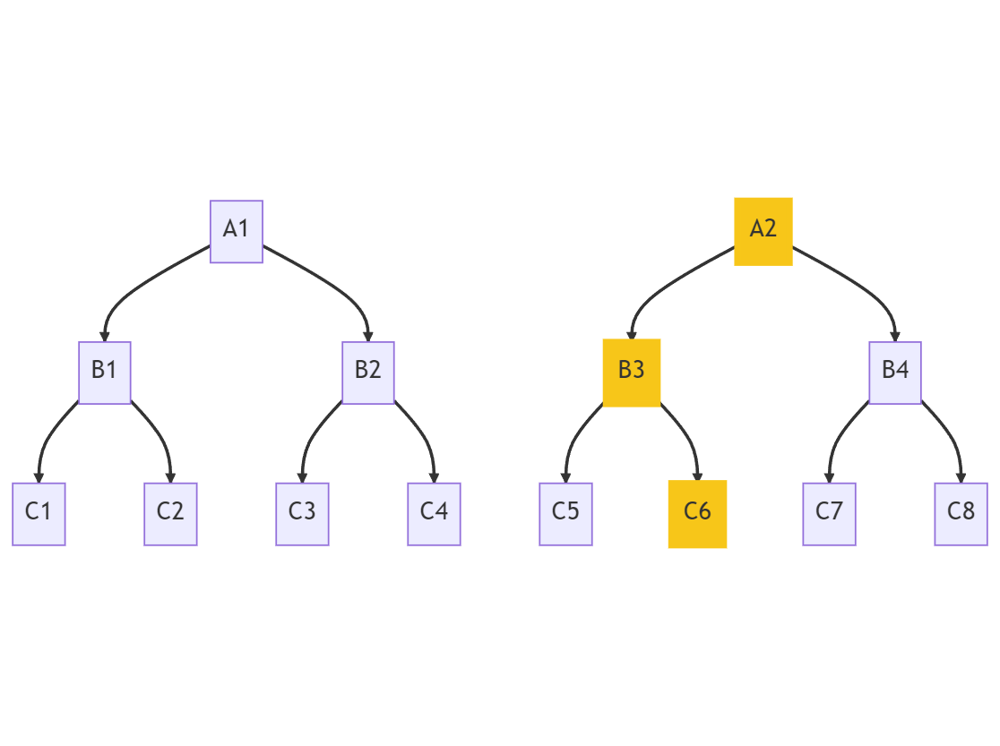
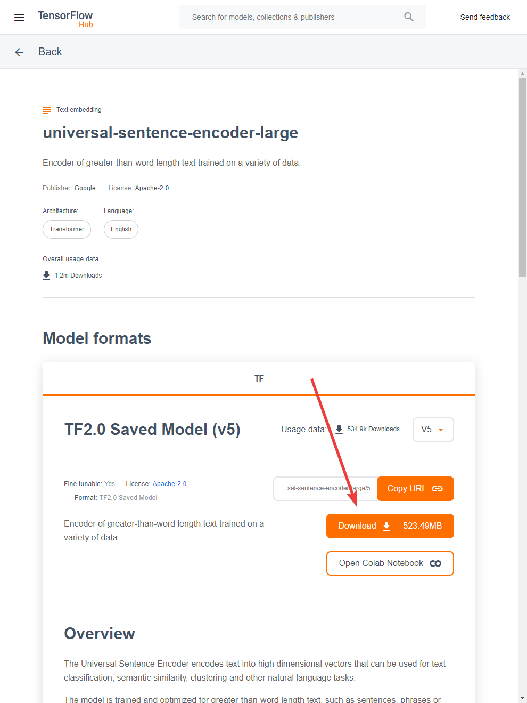

# REMO

Rolling Episodic Memory Organizer (REMO) for autonomous AI systems

- **REMO:** Recursive Episodic Memory Organizer. Efficient, scalable memory management. Organizes conversational data into taxonomical ranks. Each rank clusters semantically similar elements. Powerful tool for context-aware AI systems. Improves conversational capabilities, recall accuracy.
- **Purpose:** Assist AI systems in recalling relevant information. Enhance performance, maintain context. Supports natural language queries. Returns taxonomies of memory.
- **Structure:** Tree-like, hierarchical. Bottom rank - message pairs. Higher ranks - summaries. Embeddings via Universal Sentence Encoder v5. Clustering by cosine similarity. Message pairs utilized because smallest semantic unit with context.
- **Functionality:** Add new messages, rebuild tree, search tree. Passive microservice, memory management autonomic. Utilizes FastAPI REST API. Handles memory in concise, efficient manner.

Note: this code is still in early alpha. Testing and bugs should be expected! 

EDIT: Someone implemented REMO with LangFlow: https://github.com/hunter-meloche/REMO-langflow 



## Executive Summary 

REMO (Rolling Episodic Memory Organizer) is an AI-powered microservice that organizes large volumes of text data, such as chat logs, into a hierarchical taxonomy. The taxonomy is constructed using summaries of message pairs and message clusters, allowing users to easily search and navigate through the conversation history. REMO utilizes the Universal Sentence Encoder for generating embeddings and clustering algorithms for organizing the data. The microservice is built using FastAPI, providing a simple and easy-to-use RESTful API.

## Requirements

To run REMO, you will need the following:

- Python 3.7 or higher
- FastAPI
- TensorFlow
- TensorFlow Hub
- scikit-learn
- openai
- PyYAML


## Usage

1. Start the FastAPI server: `uvicorn remo:app --reload`
2. Interact with the API using a REST client or web browser: `http://localhost:8000`


## Models

### Embedding Model

REMO currently uses the
Universal Sentence Encoder v5 for generating embeddings.

#### Loading from TensorFlow Hub

This is the default option.

When 

```python
ARE_YOU_TESTING__LOAD_MODEL_LOCAL = False
```

in file `utils.py`, the model is loaded from TensorFlow Hub.

#### Loading from a local file

Downloading the model from TensorFlow Hub every time you need to spin up
the microservice would be expensive and time-consuming.

1. Download the `.tar.gz` file from
   TensorFlow Hub: https://tfhub.dev/google/universal-sentence-encoder-large/5

   

2. Extract the file to the folder
   ```
   models/universal-sentence-encoder-large_5/
   ```
   with
   ```shell
   tar -xvzf universal-sentence-encoder-large_5.tar.gz
   ```

3. Set
   ```python
   ARE_YOU_TESTING__LOAD_MODEL_LOCAL = True
   ```
   in file `utils.py`.

## API Endpoints

- **POST /add_message**: Add a new message to REMO. Speaker, timestamp, and content required.
- **GET /search**: Search the taxonomy for relevant nodes. Query can be any string, such as messages, context, or whatever you want.
- **POST /rebuild_tree**: Trigger a full tree rebuilding event. This deletes everything above L2_message_pairs and regenerates all clusters.
- **POST /maintain_tree**: Trigger a tree maintenance event. This attempts to fit the most recent message pairs into the current tree structure, or create new nodes.

## File Structure

- **remo.py**: The main FastAPI application file.
- **utils.py**: Utility functions for processing, clustering, and maintaining the taxonomy.
- **README.md**: Documentation for the REMO project.

## Folder Structure and YAML Files

The REMO microservice organizes conversation data into a hierarchical folder structure, with each folder representing a different taxonomical rank. Each folder contains YAML files that store the conversation data and associated metadata. Below is an overview of the folder structure and the content of the YAML files.

### Folder Structure

```
REMO/
├── L1_raw_logs/
├── L2_message_pairs/
├── L3_summaries/
├── L4_summaries/
├── ...
```

#### Description of folders

- `L1_raw_logs`: This folder contains the raw conversation logs. Each YAML file in this folder represents a single message with its associated metadata.
- `L2_message_pairs`: This folder contains message pairs, which are created by combining two consecutive raw logs. Each YAML file in this folder represents a message pair with its associated metadata and embeddings.
- `L3_summaries`: This folder contains summaries of message pairs. Summaries are created by clustering message pairs and generating a concise representation of the cluster. The structure of this folder is similar to `L2_message_pairs`, with each YAML file representing a summary and its associated metadata and embeddings.
- `...`: Additional taxonomical ranks can be created as needed when clustering summaries at higher levels.

### YAML Files

YAML files in the REMO folder structure store conversation data and associated metadata. YAML was selected because it is easily human readable for debugging and browsing. The structure of a YAML file is as follows:

```yaml
content: <conversation_content>
speaker: <speaker_name> (only applicable for raw logs and message pairs)
timestamp: <timestamp>
vector: <embedding_vector>
files: <list_of_child_files> (only applicable for message pairs and summaries at higher ranks)
```

- content: The conversation content, which can be a single message, a message pair, or a summary.
- speaker: The name of the speaker for a single message or a message pair.
- timestamp: The timestamp of the conversation, applicable for single messages or message pairs.
- vector: The embedding vector generated from the conversation content, which is used for clustering and searching.
- files: A list of child files that belong to the current summary (applicable only for summaries at higher taxonomical ranks).

## Explanation of REMO Logic

REMO organizes chat logs into a hierarchical taxonomy using a combination of semantic embeddings and clustering techniques. The process can be understood through the following steps:

1. **Semantic Embeddings**: Each message or message pair is converted into a high-dimensional semantic vector using the Universal Sentence Encoder. These vectors capture the meaning and context of the text, allowing for accurate comparisons between different messages.

2. **Clustering**: The semantic vectors are grouped together using clustering algorithms, such as k-means clustering. This process creates clusters of related messages, which can be represented by summaries at different levels of the taxonomy.

3. **Summarization**: AI language models, like GPT-3, are used to generate summaries of message pairs or clusters. These summaries provide a concise and coherent representation of the underlying conversations, making it easier for users to quickly understand the content.

4. **Taxonomy Construction**: The resulting clusters and summaries are organized into a hierarchical structure, similar to a tree. Each level of the tree represents a different level of detail, with the top levels containing general summaries and the lower levels containing more specific information.

5. **Maintenance**: As new messages are added to the system, REMO can efficiently integrate them into the existing taxonomy through periodic tree maintenance events. This ensures that the system remains up-to-date and relevant, even as new conversations are added.

The hierarchical structure created by REMO allows users to easily navigate and search through large volumes of conversation data. By starting at the top levels of the taxonomy and drilling down to the lower levels, users can efficiently explore the content and gain insights without getting overwhelmed by the details.

## Explanation of the Returned Taxonomy and its Value

The taxonomy returned by REMO is a hierarchical structure that presents conversation data at varying levels of granularity. Each level of the taxonomy represents a different level of detail, with higher levels providing general summaries and lower levels offering more specific information. This structure enables users to explore and understand large amounts of conversation data efficiently.

The value and usefulness of the returned taxonomy lie in its ability to:

1. **Simplify Navigation**: The hierarchical structure allows users to navigate conversation data in a logical and organized manner. Users can start at the top levels, which provide an overview of the main topics, and then delve deeper into the lower levels to explore specific conversations or details.

2. **Improve Searchability**: With the taxonomy in place, users can quickly and accurately find relevant conversations based on their search queries. The system identifies the most relevant nodes in the taxonomy and returns a list of associated summaries, allowing users to pinpoint the desired information without sifting through countless unrelated messages.

3. **Enhance Understanding**: The summaries generated at each level of the taxonomy provide concise and coherent representations of the underlying conversations. This makes it easier for users to grasp the main ideas and context of the conversations without needing to read through every individual message.

4. **Facilitate Knowledge Discovery**: By organizing conversations into meaningful clusters and summaries, the taxonomy helps users uncover new insights and connections between different topics or ideas. This can lead to a deeper understanding of the conversation data and the identification of previously unrecognized patterns or trends.

5. **Optimize Scalability**: The hierarchical structure of the taxonomy allows REMO to efficiently handle large volumes of conversation data. As new messages are added, the system can quickly integrate them into the existing taxonomy through periodic maintenance events, ensuring that the taxonomy remains up-to-date and relevant.


### Example REMO Taxonomy

The following example is imaginary, but serves to illustrate the value. A returned taxonomy starts broad, vague, and generic. This can be useful when working with ChatBots as they frequently lose context. However, as the taxonomy drills down, it becomes more specific, quickly giving context as well as detail. Furthermore, the recursive summarization scheme of REMO results in a *temporally invariant recall*, which means that all memories are treated equally, no matter how old they are. 

**Example Query:** 

> How does REMO handle salience?

**Example Taxonomy:**

- **Rank 3:**
  - *"Discussion about REMO, a memory system for chatbots, which uses a tree-like structure for organizing and retrieving memories."*
- **Rank 2:**
  - *"Exploration of different strategies for handling salience in REMO, focusing on clustering conversational pairs and searching through tree levels."*
- **Rank 1:**
  - *"With this search tree, you can very quickly zero in on the most salient memories AND it is intrinsically organized like a web/graph so you can "walk" to nearby memories. You can even add an algorithm so the "lightning strike" will fork a few times, like "grab the top and second most salient memories" all the way down."*

You can see that the highest rank provides some context; what is REMO and what is it for? Then you can see that the taxonomy drills down into clustering strategies. Finally, the lowest rank recalls a specific line of dialog.
